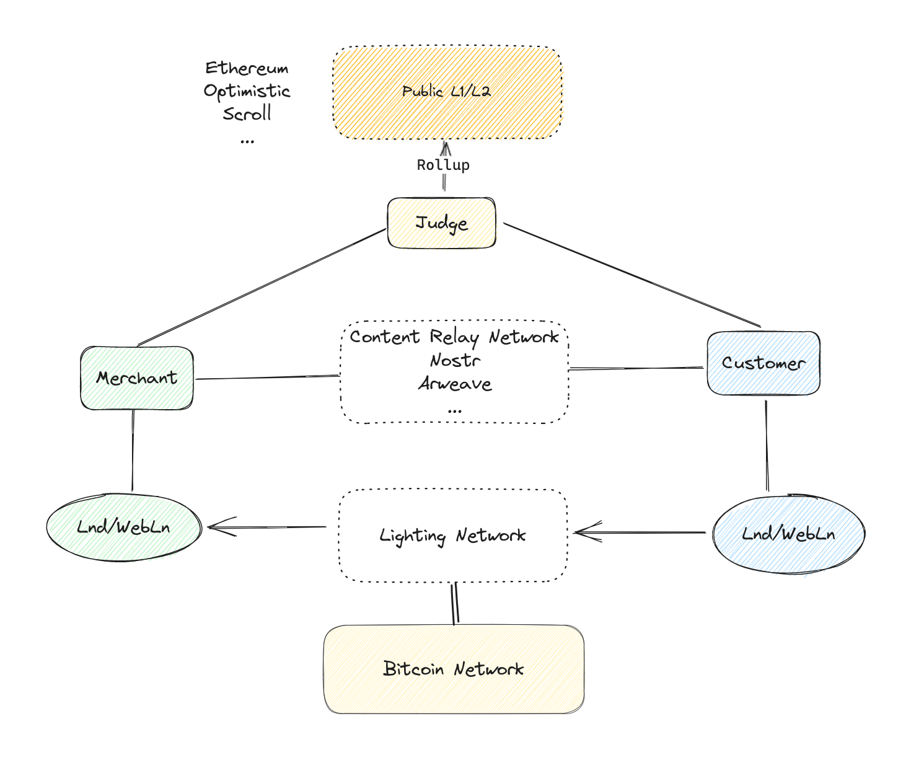
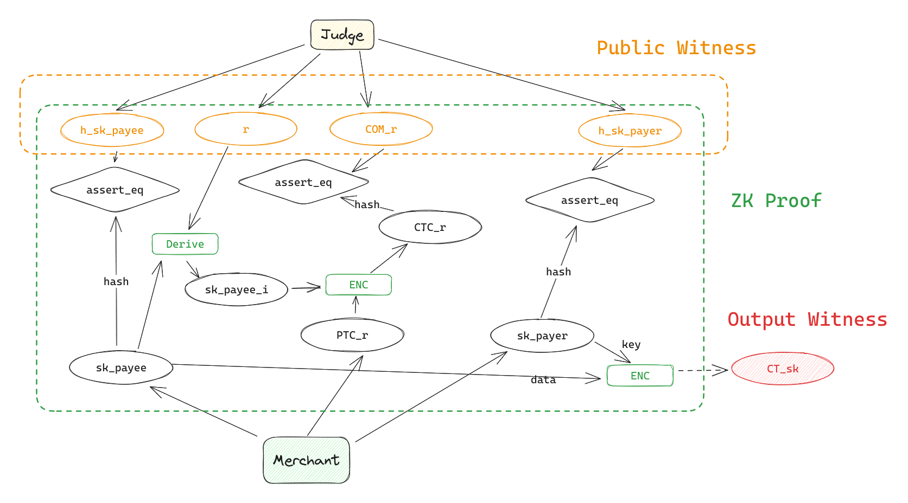

# Atomic Buy

Atom Buy: A Decentralized Framework for Trustless and Atomic Content Transactions on the Lightning Network

We introduce Atom Buy, a framework designed to facilitate trustless and atomic transactions for digital content purchases over the Lightning Network. Our proposed scheme ensures accountability for all digital content and enables each transaction to be atomic and verifiable through the application of cryptographic primitives such as Zero-Knowledge Proofs (ZKP). Furthermore, we leverage blockchain technology to safeguard each purchase and to monitor and address any instances of misconduct.

**For content creators(merchants):**
- **Trustless Transaction**: Make your digital content trusted by protential customers with **`O(1)` cost**. 
- **Full Revenue**: Enjoy the entirety of your content sales profits without any deductions.

**For customers:**
- **Content Claim**: Make sure you get the content that creator claimed as long as you paid. 
- **Atomic Purchases**: Experience the assurance that once payment is made, the delivery of your digital content is guaranteed by our robust system.
- **Zero Hidden Fees**: Our atomic purchase process is transparent, with no additional costs besides LN fee.
- **Guaranteed Compensation**: In the rare event of merchant misconduct, our system holds merchants accountable and ensures you receive due compensation.

## Design 

Core ZK Circuits 

## Workflow 

For more detail, please read our white paper: [Draft 0.11](./doc/design.md)

