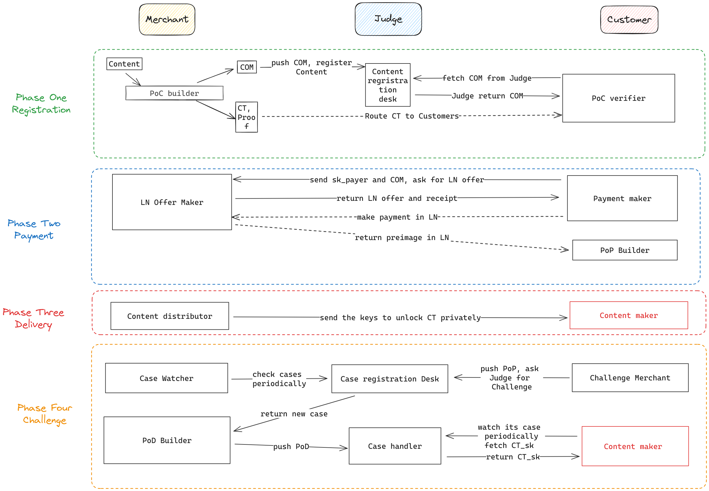

# Design of Atomic Buy 

Atom store: a framework that make the digital content purchase atomic
- O(1) cost to secure each content, nomatter how many people have bought this product. 
- No extra cost for a deal when there is no conflict. 

## Primitives 

### Ciminion

[Ciminion](https://eprint.iacr.org/2021/267) Symmetric Encryption system: a zk-friendly Symmetric Encryption system. All inputs and outputs are numbers in finite field P(`FFP`). the plaintext number must be even. 
- Encryption: `Enc()`
    - Inputs: 
        - `master key 1`
        - `master key 2`
        - `nonce`
        - `IV`
        - `plaintext[N * 2]`
    - Outputs: 
        - `ciphertext[N*2]`
        - `MAC`: message authetication code 

- Decryption: `Dec()`
    - Inputs: 
        - `master key 1`
        - `master key 2`
        - `nonce`
        - `IV`
        - `CT`: `ciphertext[N * 2]`
    - Outputs: 
        - `PT`: `plaintext[N*2]`
- MAC check: `Mac()`
    - Inputs: 
        - `master key 1`
        - `master key 2`
        - `nonce`
        - `IV`
        - `CT`: `ciphertext[N * 2]`
    - Outputs: 
        - `MAC`

We define a set of secret key `sk = [master key 1, master key 2, nonce, IV]`, and we denote alice's `sk` as `sk_alice`. 

### Poseidon Hash 
A zk-friendly hash function.                                                                                                                                                        

## Terminology 

Important terminology to understand the system. 

### Judge

A trusted programmable thrid party, like Ethereum, Arbitrum or any other L2s. 

### Content Commitment 

For any source digital content(as a vector of bytes) `C` we can parse the content to a vecotor of big number `PT` in `FFP`. 
We define `COM` as the content commitment of `C`, where `COM =  Enc(sk_payee, PT).MAC`. 

Anyone can commit a content to`Judge` by pushing the `COM` to it. 

### Proof of Content 

For content `C` we define a quantity function `Q()` with some parameters `params[...]`, when `Q(C, params) = 0` means the content `c` satisfy some quality that `Q` claimed. For examples, if `C` is a photo, `params` is the result image of some photoshop operations on `C`. `Q(c, params) = 0` claim that the `C` is the orignal image of `params`. 

we define the Claim of Content as a function `CoC(public Params, public Q, sk, PT, public COM) -> CT`, which will  claim: 
- `Q(C, Params) = 0` and 
- `Enc(sk, PT).CT = CT` and 
- `Enc(sk, PT).MAC == COM` 

We can proof this claim using any zk-prove system like Groth16, KZG-Plonk, etc. We denoted the proof of `CoC` as `PoC`, which includes every thing a verifier need to verify this claim, including verifier parameters, public witness and proof. 

Anyone can verify the ciphertext of content `CT` by querying the `COM` from the `Judge` and verifying `POC`. 

### Proof of Payment 
Every payee and payer has its own reusable ECDSA key pairs `k = (esk, epk)`. 
The proof of payment claim that "I have payed for content `C`".
In lightning network, a payment is finished when a sha256 hash `h`'s preimage revealed to the payer. 

The proof of payment `PoP` consists of two following parts: 
- `Receipt`: 
    - `h_payer = poseidon_hash(sk_payer)`: the ciminion secret key of buyers 
    - `h` : the sha256 hash of a preimage 
    - `MAC`: the content's MAC that the payer wants. 
    - `timestamp`: payment deadline for payer. 
    - `sig`: payee's signature of the three elements above
- `pre-image`: preimage of `h`

Anyone can verify this prove by verfity that if: `sign_{k_payee}(h_payer, h, timestamp) == sig && sha256(pre-image) == h`. 

### Proof of Delivery 

Once the payer pay the payee the bill to buy this content, the payer wants the payee to deliver the content to him. If the payer donot receive the content, it can ask a trusted thrid party for help(just like we cal custom service in real world).The payee must proof it has delivered the content to that third party. 

In the prove of Content stage, payee encrypted the content `C` using `sk_payee`, now payee needs to prove that it will deliver the `sk_payee` encrypted by `sk_payer` to payer. 

We denoted the claim of delivery as `CoD`, where `PoD(public h_payer,public COM, sk_payee, sk_payer, CT) -> CT_sk ` will claim: 
- `Mac(sk_payee, CT).MAC == MAC` and 
- `Enc(sk_payer, sk_payee).CT = CT_sk` and 
- `poseidon_hash(sk_payer) == h_payer`

The proof of `CoD` is denoted as `PoD`. 

Anyone can verify the `PoD` by querying `h_payer, COM` from the the `Judge`. 

## Design Abstract 

The goal of this project is to make the digital content purchase trustless and minimize the cost to achieve trustless. We achieve this by simulating the traditional Web2 e-store platform scenario, where merchant need to deposit some money when they wants to open a store in the platform like Amazon and Taobao, and the customer can ask the platform to decide whether the merchant have some misbehavior when they think they has been treated unfairly. 

In our trustless implementation, the "platfrom" is replaced by a blockchain L1 or L2(denoted as `Judge`), which provides transparent and trustless computation. Like the traditional e-commerce platform, merchant need to deposit something on `Judge`, which make merchant accountable when they doing wrong. 

We seperate the whole process into 4 phrases: 
- Phrase One: Content Registration. Just like what we do in e-commercial platform merchants need to list the product in their store, n the atomic-buy, merchant need to commit the content and its price on `Judge` , and deposit some funds on `Judge`. This will make the merchant accoutable. Meanwhile, Merchants need to build`PoC` of content. After that, Merchant can distributed the encrypted content and `PoC` in any platform like Twitter or Nostr.  And protencial customer can verity the quality of the content, and they can make sure that the the ciphertex they recieve is aligned with the content commited on `Judge`.  
- Phrase Two: Make Payment. Thanks to the beauty of LN, a payment proof `PoP`("alice pay `x` sats for content `c` before time `T`") can be built only with merchant and customer. Once the customer get the `PoP`, they can ask `Judge` for customer service when something bad happened. 
- Phrase Three: Content delivery: Once the merchant believe that the bill has been payment, it need to delivery the key that can unlocked the ciphertext asap to the customer in any message routine platform. 
- Phrase Four: challenge. The goal of challenge is to make sure the keys must be delivered to customer through `Judge`. Merchant need to build a `PoD` to prove the keys. If the Merchant can not provide `PoD` in time, the `Judge` will fine the merchant and conpensate the customer. 

## Security Model 

## Attacks 

## 

## Implementation 

## Cost 

## Roadmap 

