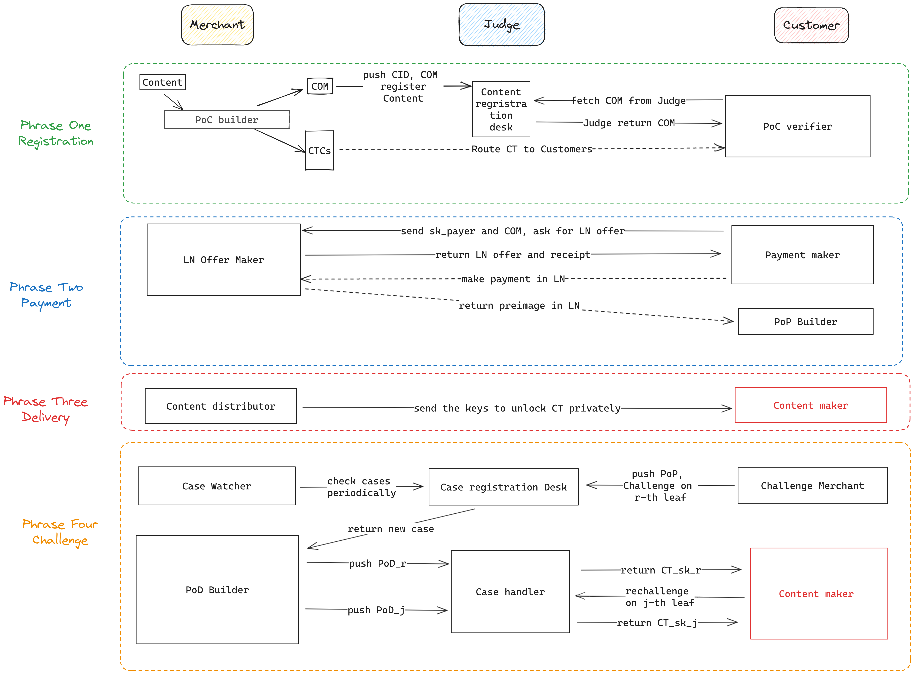

# Atomic Buy 

Atom Buy: a decentralized paid content distribution framework that make the digital content purchase on the Lightning Network atomic and trustless. We propose a purchase scheme which make every digital content accoutable and every digital content purchase atomic and verifable using various cryptography primitives like ZKP. Then we using blockchain technology protect every purchase and detect the misbehavior.  

## Introduction 

### Problem we want to solve
In the landscape of paid content distribution, both centralized content platforms and independent distribution by content creators present distinct challenges.

The drawbacks of using centralized platforms for paid content sharing — such as academic paper repositories, knowledge paywalls, and sites like OnlyFans — are significant and multifaceted:

- **Trust and Dependency on the Platform**: Content creators (merchants) are forced to place their trust in these platforms, which pose a risk of content leakage. Meanwhile, platforms retain control over the content and users' data, limiting creators' direct relationship with their audience and complicating efforts to move to other distribution methods or platforms.
- **Censorship**: Centralized platforms have the authority to censor content and users, which can be based on a variety of factors, often opaque and outside the control of the content creators and consumers. This can lead to a suppression of freedom of expression and access to information.
- **Fees and Revenue Sharing**: These platforms often take a substantial cut of the creators' earnings, which can greatly reduce the profit margin for the creators. 

In contrast, independent distribution methods that creators might use, like mailing lists or personal websites, have their own set of challenges: **Trust and Verification**: Without the reputation and the protection of a known platform, creators must build trust with their audience from scratch. Consumers might be hesitant to purchase from an unknown source without the assurance of quality and delivery.

### What we aim to build

To tackle the aforementioned issues, we propose a decentralized paid content distribution (DPCD) framework. Our system ensures:

- **Content Pre-commitment**: Every piece of content that merchants wish to sell is pre-committed to a trustless third party. Customers can verify the content before completing the purchase.
- **Atomic Purchase**:The delivery of your digital content is secured by our dependable system once you make the payment. 
- **Guaranteed Compensation**: Should merchant misconduct occur, our system holds the merchants responsible and guarantees that customers receive appropriate compensation.

Leveraging this framework, we can create a range of decentralized counterparts to Web2 services, circumventing the pitfalls of centralization.  Furthermore, the Atomic Buy itself can serve as an incentivization layer within existing content distribution applications such as Nostr, IPFS, and BitTorrent.

## Overview  

Atomic Buy is inspired by the scenario of a traditional Web2 e-commerce platform, where merchants are required to deposit funds as a form of security when they wish to open a store on platforms like Amazon or Taobao. If customers feel they have been treated unfairly, they can request the platform to adjudicate any alleged misconduct by the merchant.

In our trustless and decentralized model, the "platform"'s Job is substituted by three components: **content relay network**, **payment network** and **Judge**. 

**Content relay network** will become the comminication layer between merchants and customers, distributing content infomation from merchants to customers. Depending on the usecase, we could use different relay network. For example, to build the decentralized vertsion of Onlyfans, Medium, we could use relay network like Nostr, which provides async routine service for both public and private message in a decentralized manner. If we want build a decentralized academic database, We could use service like Arweave, IPFS as the content storage, and any other message service for private commuication between merchants(content creators) and customers. 

**Payment network** is where users pay some cryptocurrency to the merchants, and generate a veriable proof of purchase "I spent x money for product(content) C". The proof of purchase is the primitives for `Judge` esttle the arguments between merchants and customers. In our implementation, we use Lightning Network as the payment network, as it can easily settle a `PoP` lighting fast without onchain verification. 

**Judge** is a accountable and verifable third party, which is secured by a blockchain L1/L2, or it can be a L1 itself. Similar to a conventional e-commerce platform, merchants are obliged to place a deposit on `Judge`, which holds them accountable in cases of wrongdoing. And `Judge` can detect and punish those who cheat in a content purchase, which make the purchase trustless for customers. 

## Primitives 

### Ciminion

[Ciminion](https://eprint.iacr.org/2021/267), a zk-friendly symmetric Encryption system. All inputs and outputs are numbers in finite field P(`FFP`). the plaintext number must be even. 
- Encryption: `Enc()`
    - Inputs: 
        - `master key 1`
        - `master key 2`
        - `nonce`
        - `IV`
        - `plaintext[N * 2]`
    - Outputs: 
        - `ciphertext[N*2]`
        - `MAC`: message authetication code 

- Decryption: `Dec()`
    - Inputs: 
        - `master key 1`
        - `master key 2`
        - `nonce`
        - `IV`
        - `CT`: `ciphertext[N * 2]`
    - Outputs: 
        - `PT`: `plaintext[N*2]`
We define a set of secret key `sk = [master key 1, master key 2, nonce, IV]`, and we denote alice's `sk` as `sk_alice`. 

### Poseidon Hash 
A zk-friendly hash function.                                          

## Terminology 

Important terminology to understand our system. 

### Content Commitment 
Merchants commits digital contents in `Judge`. 

Every payee(merchant) and payer(customer) has its own reusable ECDSA identity key pairs `ek = (esk, epk)`. This is used to verify the identity of payees and payers. Besides payee will generate a new ciminion symmetric encryption key`sk_payee` pair for content commitment. 

For a digital content(as a vector of bytes) `C` we can parse the content to plaintext `PT`(presented by big numbers) in a finite field like BN-254. Then we divides `PT` in to fixed sized `PT` chunks `PTC`.(like 512 numbers per `PTC`). 

After plaintext division, we generate cominion keys to encrypt each chunk `PTC_i` to ciphertext chunk `CTC_i`. For each `PTC_i`, we will derive a secret key `sk_payee_i` to encrypt this chunk by tunning the nonce of `sk_payee`. `sk_payee_i <= sk_payee` and `sk_i.nonce <= poseidon_hash(sk.nonce, i)`. ciphertext chunk i `CTC_i = Enc(sk_payee_i, PT_i).CT `. 

We define `COM_i` as the content commitment of `PTC_i`, where `COM_i =  poseidon_hash(CTC_i)`
Then we build a merkle tree from `COM_i` with poseidon hash, generating the merkle root hash `COM`. 

Any merchant can commit a content `C` to`Judge` by pushing the (`epk_payee`, `COM`, `h_sk = poseidon_hash(sk_payee)`) to it. This send a message **"I have a content encrypted by `sk`**. 

### Proof of Content 

We define the Claim of Content as a function `CoC({sk_payee_i}, {PTC_i}) -> CT`, which  claims: 
- `Enc(sk_payee_i, PTC_i).CT = CTC_i` 

We denoted the proof of `CoC` as `PoC`, where `PoC = [{CTC_i}, {poseidon_hash(CTC_i)} ]` 

customer can verify the ciphertext of content `PT` by  building merkle tree from `POC`, verify if the merkle root is equal to the `COM` in `Judge`. 

### Purchase Request

When a customer want to buy some content committed by `COM`, it make a `Purchase Request` to Merchant. The request contain `(sk_payer, COM)`,which tell the merchant that **"I want to by content committed by `COM`, and give me the decryption key `sk_payee` safely, by encypted `sk_payee` using `sk_payer`**. 

### Proof of Purchase

The proof of purchase proves that **"I have paid enough money for content `C`"**.
In lightning network, a payment is settled when the sha256 hash `h` of a preimage revealing to the payer. 

The proof of Purchase `PoP` consists of two following parts: 
- `Receipt`: 
    - `h_sk_payer = poseidon_hash(sk_payer)`: the ciminion secret key of buyers 
    - `h` : the sha256 hash of a preimage 
    - `COM`: the content that the payer wants. 
    - `timestamp`: payment deadline for payer. 
    - `sig`: payee's signature of elements above
- `pre-image`: preimage of `h`

`Judge` can verify this prove by verfity that if: `sign_{k_sk_payee}(h_sk_payer, h, timestamp) == sig && sha256(pre-image) == h`. 

### Challenge 

Upon settling the bill, the payer expects the payee to provide the decryption keys (sk_payee), which are used to decrypt CTC_i. Should the payer not receive the correct keys as anticipated, they have the option to appeal to a Judge for resolution, akin to contacting customer service in real-life scenarios. This procedure is referred as a challenge.

During the challenge phase, the payer must submit a challenge dataset CD to the Judge. This dataset CD comprises (PoP, r, COM_r, Merkle_path_r), where r represents a randomly selected leaf number from the CTC Merkle tree's leaves.

The submission to the Judge conveys the following message: **"I have remitted payment for the content COM, and I request the seller to provide the decryption keys for the r-th ciphertext chunk COM_r."**

Upon receiving the challenge request from the customer, the Judge is tasked with validating the request by:

- Verifying the proof of payment (PoP).
- Confirming the membership of `COM_r` by verifing the Merkle path. 

### Proof of Delivery 

Once a payee find someone `challenge` him. The payee must proof it has delivered the content to `Judge`. 

We denoted the claim of delivery as `CoD`, where `CoD(public h_sk_payer, public h_sk_payee, public COM_r, public r, sk_payee, sk_payer, PTC_r) -> CT_sk ` will claim: 
- `poseidon_hash(sk_payee) == h_sk_payee` and 
- `sk_payee_r.nonce = poseidon_hash( (sk_payee.nonce  || r) )` and 
- `Enc(sk_payee_r, PTC_r) = CTC_r` and 
- `poseidon_hash(CTC_r) == COM_r ` and 
- `Enc(sk_payer, sk_payee).CT = CT_sk` and 
- `poseidon_hash(sk_payer) == h_sk_payer`

In human readable word, this claim that **"I will send you `sk_payee`, which is the same key that I committed in `Judge`; The secret key(`sk_payee`) can encrypt the plaintext chunk `PTC_r` into ciphertext chunk`CTC_r`; Hash of `CTC_r` is the same as the cusomter received; We deliver the right key `sk_payee` encrypted by customer key provided before(committed by `h_sk_payer`)."**
The proof of `CoD` is denoted as `PoD`, which is generated using Groth16 in Circom and Snarkjs. 

Judge can verify the `PoD` by querying `h_payer, COM` from the the `Judge`. 

## Workflow 

We seperate the whole process into 4 phases: 
- Phase One: Content Registration. Merchants must register their content and its price on `Judge`, along with depositing some funds. This holds the merchants accountable. Additionally, merchants are required to create a Proof of Content (PoC) for the content. Subsequently, merchants can distribute the encrypted content and `PoC` on any platform such as Twitter or Nostr. Potential customers can then verify the content's quality and ensure that the ciphertext they receive corresponds with the content committed on Judge.
- Phase Two: Payment. Leveraging the advantages of the Lightning Network (LN), a payment proof PoP ("alice pays x satoshis for content `c` before time `T`") can be established solely between the merchant and customer. Should any issues arise, the customer can present the `PoP` to Judge for resolution.
- Phase Three: Content delivery: Once the merchant believe that the bill has been payment, it need to delivery the key that can unlocked the ciphertext ASAP to the customer in any message routine platform. 
- Phase Four:  Challenge. The challenge phase ensures that keys are delivered to the customer via Judge. Merchants are required to construct a Proof of Delivery (PoD) to verify the delivery of keys. Failure to provide a `PoD` within the stipulated timeframe results in penalties imposed by Judge on the merchant and compensation awarded to the customer.

